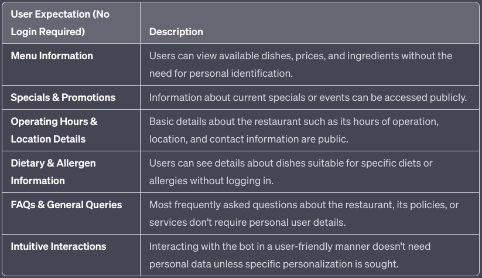

# Introduction
Gus is an Restaurant Chatbot. It can handle General Queries, enqueries regarding Menu, Specials & Promotions, Operating Hours & Location Details, Dietery & Allergen Information, FAQs.

---
<!-- ### Layout
- actions/
    - actions.py
- data/
    - nlu/
        - lookups/
        - responses/
            - chitchat_oss.yml
            - general.yml 
        - chitchat.yml
        - faq.yml
        - general.yml
        - nlu.yml
        - oss.yml
        - synonyms.yml
    - rules/
        - fallback.yml
        - feedback.yml
        - forms.yml
        - rules.yml
    - stories/
        - chitchat.yml
        - oos.yml
        - stories.yml
- models/
- tests/
- config.yml
- domain.yml
- endpoints.yml
- credentials.yml -->
---


### Features to Implement


### Upgrading Rasa in your python virtual environment
```bash
pip install rasa --upgrade
```

# References

- [Sara - Rasa Demo Bot](https://github.com/RasaHQ/rasa-demo/)
- [Rasa Tutorial](https://learning.rasa.com/conversational-ai-with-rasa/)
- [Rasa Documentation](https://rasa.com/docs/rasa/)
- [Handling Large JSON files using ijson](https://medium.com/@AlexanderObregon/json-streaming-how-to-work-with-large-json-files-efficiently-c7203de60ac2#:~:text=JSON%20streaming%20is%20a%20technique,might%20not%20fit%20into%20memory)